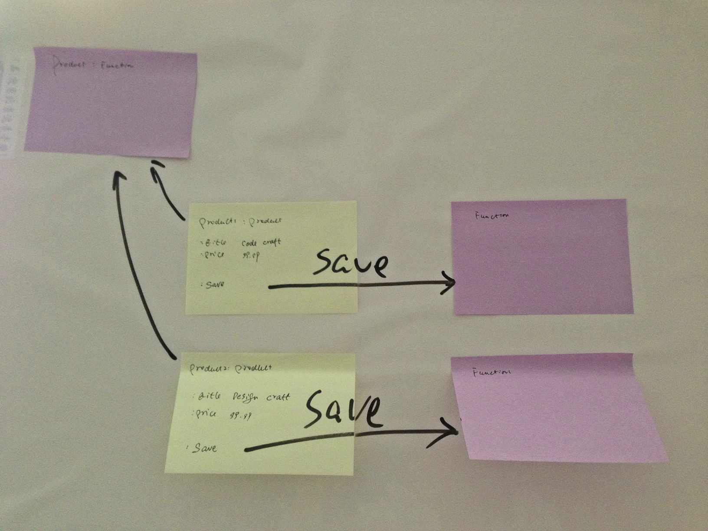
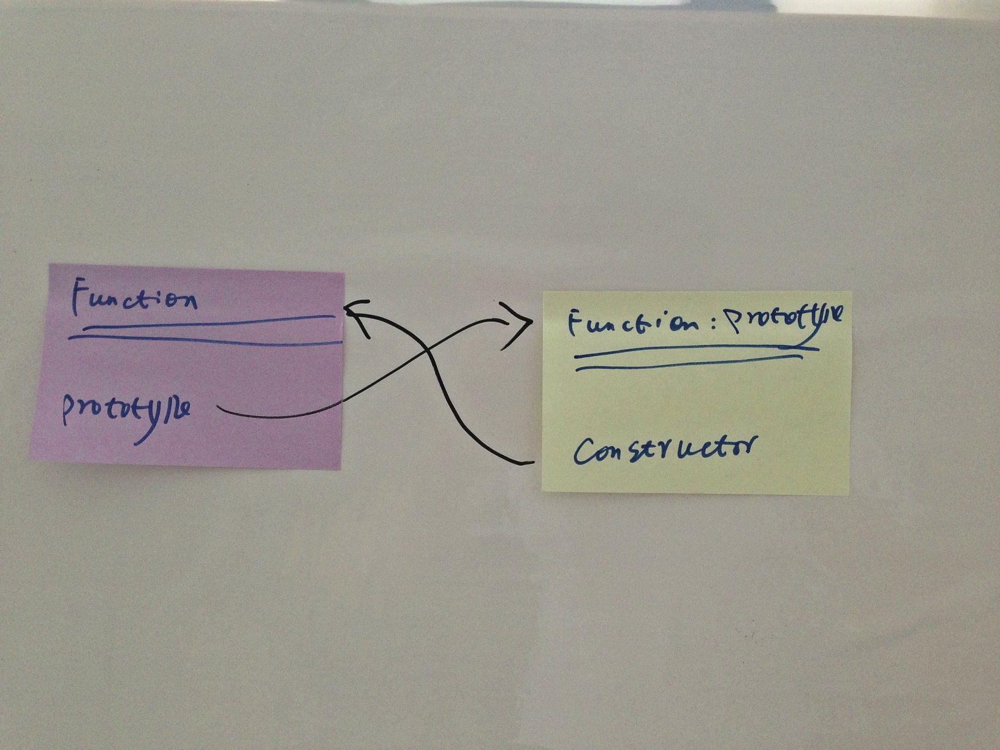
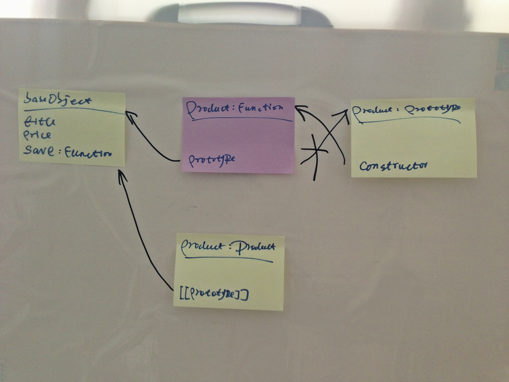

> 可通过添加微信公共帐号`icodekata`，或者微博帐号`姜志辉iS`与我讨论

## 基本对象

JavaScript提供了两个基本的创建对象的方法：

	'use strict';
	var assert = require("assert");

	describe('object', function() {
		it('{}', function() {
			var product = {
				title: 'Code Craft',
				price: 99.99
			};
			assert('Code Craft', product.title);
			assert(99.99, product.price);
		});
		it('new Object()', function() {
			var product = new Object();
			product.title = 'Code Craft';
			product.price = 99.99;
			assert('Code Craft', product.title);
			assert(99.99, product.price);
		});
	});

- 一种是通过对象字面量来表示一个对象。这种方式比较简洁、清晰。很直观的表达了对象的结构。
- 另一种则通过`new Object()`来创建一个对象变量，然后根据JavaScript动态语言的特点，为对象添加属性。

JavaScript比较推荐对象字量量的方式，当我们使用JSHint进行语法检查时，会提示将`new Object()`的方式转化为`{}`。

## 工厂模式

在实际的工作场景中，很多时间事先对对象的属性值一无所知，需要根据上下文的内容创建对象。比如需要用户的输入或者数据库创建对象。这个时候对象的属性值是不断变化的，而工厂模式则可以抽象具体对象的创建过程，以应对变化点：

	'use strict';

	var assert = require('assert');

	function createProduct(title, price) {
		var o = {};
		o.title = title;
		o.price = price;
		return o;
	}

	describe('factory method', function() {
		it('should return product', function() {
			var product = createProduct('Code Craft', 99.99);
			assert('Code Craft', product.title);
			assert(99.99, product.price);
		});
	});

工厂模式解决了创建具有相同接口的相似对象的问题，但是却没有解决对象识别的问题。比如当我们使用`instanceof`时，product只能被标识为Object。

## 构造函数

JavaScript是一门原型语言，极富表现力。但这偏离了目前大多数语言是基于类的主流风格。也就是说它本身是没有类的，因此很难被程序员广泛接受。在这方面JavaScript也缺乏足够的信心，所以它提供了一套和其于类的语言类似的构造函数式的语法。

	'use strict';
	var assert = require('assert');

	function Product(title, price) {
		this.title = title;
		this.price = price;
	}

	describe('constructor', function() {
		it('should return Product object', function() {
			var product = new Product('Code Craft', 99.99);
			assert('Code Craft', product.title);
			assert(99.99, product.price);
			assert(product instanceof Product);
			assert.equal(Product,product.constructor);
		});
	});
	
通过构造函数创建的product可以通过`instanceof`判断它的类型。其中Product的`P`采用大写，是想告诉使用者，这个函数是构造函数，需要使用`new`来创建对象。但是这也仅仅是一个命名标识，并不能真正阻止它被当作函数调用。

而且这种写法其实可以被工厂方法替代。

	function Product() {};

	function createProduct(title, price) {
		var o = {
			title: title,
			price: price,
			constructor: Product
		};
		return o;
	}
	var product = createProduct('Code Craft', 99.99);
	
使用工厂方式创建的对象，无法被`instanceof`识别。这是构造函数的优势。

然而，构造函数虽然好用，但是每个方法都要在每个实例上重新创建一遍。比如，我们为Product添加save方法。

	function Product(title, price) {
		this.title = title;
		this.price = price;
		this.save = function() {
			//mongodb
		};
	}
	var product1 = new Product('Code Craft',99.99);
	var product2 = new Product('Design Craft',99.99);
	
那么，product1与product2都有一个名为save的方法，但这两个方法却不是同一个Function的实例。方法是将save函数的定义转移到构造函数的外部。但是这破坏了对象的封装性。

## 原型模式

原型模式可以解决这个问题。

让我们先从原型说起。

### 理解原型对象

只要创建函数，就会自动为该函数创建一个prototype属性。这个属性指向该函数的原型对象。在默认情况下，所有原型对象都会自动获得一个constructor属性，这个属性指向函数。

创建了自定义的构造函数之后，其原型对象默认只会取得constructor属性；至于其他方法，则都是从Object继承而来的。当调用构造函数创建一个新实例后，该实例的内部将包含一个指针，指向构造函数的原型对象。ECMAJavaScript5中管这个指针叫[[Prototype]].在Firefox、Safari和Chrome中则直接将其命名为__proto__。

	'use strict';
	var assert = require('assert');

	var baseObject = {
		title: 'Code Craft',
		price: 99.99,
		save: function() {
			return true;
		}
	};

	function Product() {}

	Product.prototype = baseObject;
	Product.prototype.constructor = Product;

	describe('prototype', function() {
		it('should return Product object', function() {
			var product = new Product();
			assert.equal('Code Craft', product.title);
			assert.equal(99.99, product.price);
			assert(product.save());
			assert(Product, product.__proto__, baseObject);
		});
	});
	

	
在上面的示例中，Product.prototype的值被重置了，使其等于baseObject。但是如此会致使调用product.constructor的时候丢失product的类型信息，所以在重置之后，将baseObject的constructor指向Product。在调用product的属性时，如果在product中无法找到该属性，会通过[[Prototype]]向上找到Product.prototype，也就是baseObject。然后在baseObject中查找该属性。`assert(Product, product.__proto__, baseObject);`可以证明product的原型其实就是Product.prototype，也就是baseObject。

原型模式的缺点是省略了为构造函数传递初始化参数这一环节，结果所有实例的属性都是共享的。对于函数这是合理的，但属性就会带来不必要的麻烦。

## 组合模式

构造函数模式用于定义实例属性，而原型模式用于定义方法和共享的属性。每个实例都会有自己的一份实例属性的副本，但同时又共享对方法的引用，最大限度地节省了内存。

	'use strict';
	var assert = require('assert');

	function Product(title, price) {
		this.title = title;
		this.price = price;
	}

	Product.prototype = {
		constructor: Product,
		save: function() {
			return true;
		}
	};

	describe('hybrid', function() {
		it('should return Product object', function() {
			var product = new Product('Code Craft', 99.99);
			assert.equal('Code Craft', product.title);
			assert.equal(99.99, product.price);
			assert(product.save());
		});
	});
	
组合模式是目前最广泛，也是我本人最推崇的方式。

## 稳妥模式

稳妥模式其实就是一种工厂模式。通过函数的作用域控制数据的访问。它由Douglas Crockford提出。

	'use strict';
	var assert = require('assert');

	function Product(title, price) {
		var o = {};
		o.getTitle = function() {
			return title;
		};
		o.getPrice = function() {
			return price;
		};
		o.save = function() {
			return true;
		};
		return o;
	}

	describe('hybrid', function() {
		it('should return Product object', function() {
			var product = new Product('Code Craft', 99.99);
			assert.equal('Code Craft', product.getTitle());
			assert.equal(99.99, product.getPrice());
			assert(product.save());
		});
	});
	
变量保存的是一个稳妥对象。除了指定的方法外，没有别的方式可以访问传入到函数中的原始数据。