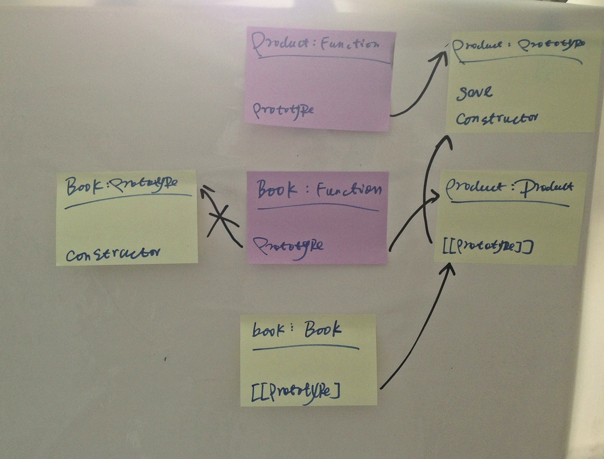
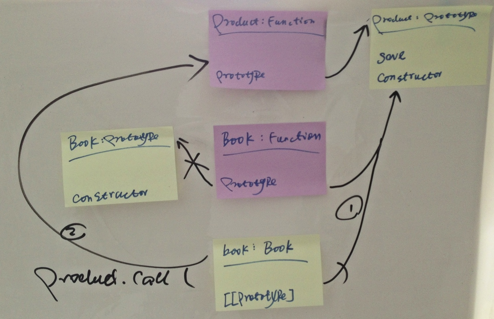
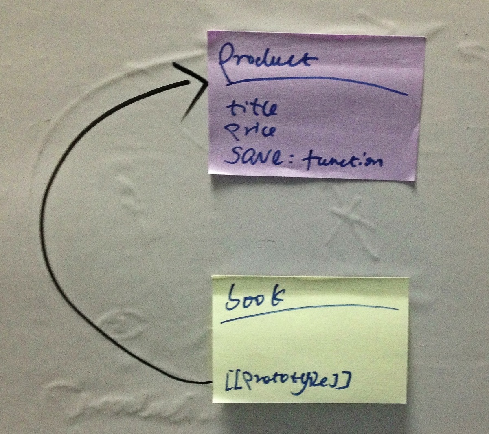

> 可通过添加微信公共帐号`icodekata`，或者微博帐号`姜志辉iS`与我讨论

我不太喜欢继承这个词。事实上，我一直认为继承是造成很多设计糟糕的原因。继承做为代码重用的手段之一，而不是目标。我们应该争取编写尽可能少的代码，并且尽可能多的复用自己或者其他人已经编写过的现有代码。尤其是那些质量优秀的、经过反复测试的、可维护、可扩展的可复用代码。

## 伪类

在基于类的语言中，对象是类的实例，并且类可以从另一个类继承。继承对于基于类的语言来说，除了重用之外，类继承的另一个好处是类型的规范检查。

而JavaScript是基于原型的，对象直接从其他对象继承。最简单的方式就是`sub.__proto__ = super`。而类继承带来的类型检查对于JavaScript这样一门弱类型语言是无效的。虽然可以通过`constructor`找到对象的类型，但那并不怎么靠谱。

JavaScript给不熟悉JavaScript的程序员提供了一个构造函数的“伪类”方式，

### 原型链

JavaScript通过构造函数来模仿类。构造函数new出来的对象，通过[[prototype]]指向构造函数的原型。当调用对象的方法时，会首先在对象中寻找这个方法，如果没有就会顺着[[prototype]]在构造函数的原型中寻找。

创建一个构造函数A，断开系统为它默认提供的原型对象，而使其指向构造函数B的“实例”。那么构造函数A的实例(a)的[[prototype]]其实就指向了构造函数B的实例(b)，于是就营造了一个A是B的子类的假象。以Product为例。

	'use strict';
	var assert = require('assert');

	function Product() {}
	Product.prototype.save = function() {
		return true;
	};

	function Book() {}
	Book.prototype = new Product();

	describe('PrototypeChaining', function() {
		it('book should be product', function() {
			var book = new Book();
			assert(book.save());
		});
	});
	

Book没有使用默认提供的原型，而是指向了Product的实例。当调用book的save方法时，book在自身找不到save.就会沿着[[prototype]]，也就是Product的实例寻找。但是Product的实例中也没有。那么就会沿着Product实例的[[prototype]]寻找。`book-->book.__proto__-->(new Product())-->(new Product()).__proto__-->Product.prototype`,在那里可能找到save方法。当调用book.save()时，当前作用域的this是book。相当于`save.call(book)`。

实际上真正建立起原型链的是对象。伪类掩盖了它的原型机制，反而插入了一个多余的间接层，通过构造函数产生对象，建立原型链体系。

原型链有两个问题需要面对：

- 如果父构造函数使用了参数，子构造函数并不支持参数的传递
- 子构造函数创建的多个实例指向同一个原型，可能会造成污染

### 借用构造函数

借用构造函数可以用来解决从子构造函数到父构造函数参数传递的问题。

	'use strict';
	var assert = require('assert');

	function Product(title) {
		this.title = title;
	}
	Product.prototype.save = function() {
		return true;
	};

	function Book(title) {
		Product.call(this, title);
	}
	Book.prototype = new Product();

	describe('PrototypeChaining', function() {
		it('book should be product', function() {
			var book = new Book('OO4JS');
			assert.equal('OO4JS', book.title);
			assert(book.save());
		});
	});

在Book构造函数中调用Product，从而可以在子类型构造函数向超类型构造函数传递参数。

但我仍然使用了`Book.prototype = new Product();`。因为定义良好的对象应该将复用的函数定义在原型中，如果只调用`Product.call()`,那么定义在Product.prototype中的方法就会丢失。虽然也可以将save方法定义在Product的构造函数中，但那显然不是合理的设计。

其实这样也不合理，因为Product被调用了两遍。一次是在Book构造函数内，一次是设置Book.prototype时。在Book构造函数里调用之后，再次在设置Book.prototype时调用Product，其实是想将Product.prototype里的可复用的方法继承下来。而定义良好的对象应该将任何值得继承的东西放置在原型中。所以第二次调用完全可以省略,改为指向Product.prototype。

	'use strict';
	var assert = require('assert');

	function Product(title) {
		this.title = title;
	}
	Product.prototype.save = function() {
		return true;
	};

	function Book(title) {
		Product.call(this, title);
	}
	// Book.prototype = new Product();
	Book.prototype = Product.prototype;

	describe('PrototypeChaining', function() {
		it('book should be product', function() {
			var book = new Book('OO4JS');
			assert.equal('OO4JS', book.title);
			assert(book.save());
		});
	});

Book构造函数在选择重用的情况下，采用了两个步骤：

- 将自身的原型指向超构造函数的原型，因为那里的成员本来就被设计为可共享的
- 初始化自身的属性值时，将超构造函数作为函数调用，复用初始化的步骤。

根据实际情况选择如何复用。比如可以将方法全部放置在构造函数中。通过借用构造函数实现多继承。JavaScript在表现力上非常的灵活。

### 间接构造函数

借用构造函数可以用来解决从子构造函数到父构造函数参数传递的问题。但是子构造函数创建的多个实例指向同一个原型，可能会造成污染的问题仍然没有得到解决。而且更加严重了。

根据将复用的函数定义在原型中的习惯，设置Book的函数`Book.prototype.publish = function(){}`，而此时Book.prototype实际上指向的是Product.prototype。publish方法是Book特有的，但是当为Book.prototype添加publish方法时，Product也有了publish方法，这显示是不合理的。

	'use strict';
	var assert = require('assert');

	function Product(title) {
		this.title = title;
	}
	Product.prototype.save = function() {
		return true;
	};

	function Book(title) {
		Product.call(this, title);
	}
	Book.prototype = Product.prototype;
	Book.prototype.publish = function() {
		return 'published';
	};

	describe('PrototypeChaining', function() {
		it('product should have the publish method', function() {
			var product = new Product('OO4JS');
			assert.equal('published', product.publish());
		});
	});
	
在计算机领域，很多复杂的问题都可能通过一个间接层来完成。

	'use strict';
	var assert = require('assert');

	function Product(title) {
		this.title = title;
	}
	Product.prototype.save = function() {
		return true;
	};

	function Book(title) {
		Product.call(this, title);
	}

	function F() {}
	F.prototype = Product.prototype;

	Book.prototype = new F();
	Book.prototype.publish = function() {
		return 'published';
	};

	describe('PrototypeChaining', function() {
		it('product should not publish method', function() {
			var product = new Product('OO4JS');
			assert(typeof product['publish'] === 'undefined');
		});
		it('book should have the publish method', function() {
			var book = new Book('OO4JS');
			assert.equal('published', book.publish());
		});
	});
	
为Book和Product之间添加一个间隔构造函数F,避免原型的污染。

让我们再进一步。为Book存储超类原型的引用，以便于在子对象里调用基对象的方法。同时重置构造函数指针，以免在将来的某个时候还需要该构造函数。

	function F() {}
	F.prototype = Product.prototype;
	Book.prototype = new F();
	Book.uber = Product.prototype;
	Book.prototype.constructor = Book;
	
## 原型式继承

如前所述。真正建立起原型链的是对象。伪类掩盖了它的原型机制，反而插入了一个多余的间接层，通过构造函数产生对象，然后帮助建立原型链体系。那为什么不可能摒弃类，转而专注于对象。这本来就是JavaScript的初衷。基于原型的继承相比基于伪类的继承在概念上更为简单。

道格拉斯.克罗克福德专门介绍了一种实现继承的方法，这种方法并没有使用严格意义上的构造函数。而是借助原型基于已有的对象上创建新对象。这是一种差异化继承。通过定制一个新的对象，指明它与所基于的基本对象的区别。

	function object(o) {
		function F() {}
		F.prototype = o;
		return new F();
	}
	
其实使用`newObject.__proto__ = o`更简单。但因为`__proto__`并不是所有的运行环境都支持。所以克罗克福德采用了一种变通的方法。

ECMAScript5中新增了一个Object.create()方法规范化了原型继承。

	'use strict';
	var assert = require('assert');

	var product = {
		title: 'OO4JS',
		price: 99.99,
		save: function() {
			return true;
		}
	};

	describe('prototype inherit', function() {
		it('book is product', function() {
			var book = Object.create(product);
			assert.equal('OO4JS', book.title);
			assert.equal(99.99, book.price);
			assert(book.save());
		});
	});

没有必要兴师动众地创建构造函数，原型式继承让我们只需要关注于差异化扩展即可。

Object.create()接受一个额外的参数对象。这个额外对象的属性将会被添加到新对象中，以此作为新对象自身的属性。

		var book = Object.create(product, {
			publish: {
				value: function() {
					return 'published';
				}
			}
		});
		
## Mix-in

采用原型链，多个实例对象的[[prototype]]指向同一个原型。如是其中一个实例对象更新了[[prototype]]对象，就会影响到其它对象。多数情况下，这没有问题，因为prototype对象里本身就是共用的方法。但如果需要绝缘这种关系，最好使用复制式继承。

	'use strict';
	var assert = require('assert');

	var product = {
		title: 'OO4JS',
		price: 99.99,
		save: function() {
			return true;
		}
	};

	var book = {};
	for (var attr in product) {
		if (product.hasOwnProperty(attr)) {
			book[attr] = product[attr];
		}
	}

	describe('prototype inherit', function() {
		it('book is product', function() {
			assert.equal('OO4JS', book.title);
			assert.equal(99.99, book.price);
			assert(book.save());
		});
	});
	
这种通过复制实现继承的思想可以进一步扩展。Mix-in(混入)允许从多个对象中复制出需要的成员组成一个新的对象。

	'use strict';
	var assert = require('assert');

	var product = {
		title: 'OO4JS',
		price: 99.99
	};

	var persistence = {
		save: function() {
			return true;
		}
	};

	function include() {
		var arg, prop, o = {};
		for (arg = 0; arg < arguments.length; arg += 1) {
			for (prop in arguments[arg]) {
				if (arguments[arg].hasOwnProperty(prop)) {
					o[prop] = arguments[arg][prop];
				}
			}
		}
		return o;
	}

	describe('prototype inherit', function() {
		it('book is product', function() {
			var book = include(product, persistence);
			assert.equal('OO4JS', book.title);
			assert.equal(99.99, book.price);
			assert(book.save());
		});
	});

伪类、原型式继承、Mix-in各有其适用的场景。在实际的过程中，要灵活应用。

事实上，它们很少单独使用的。不信你找个著名的开源项目研究一下。  ：）